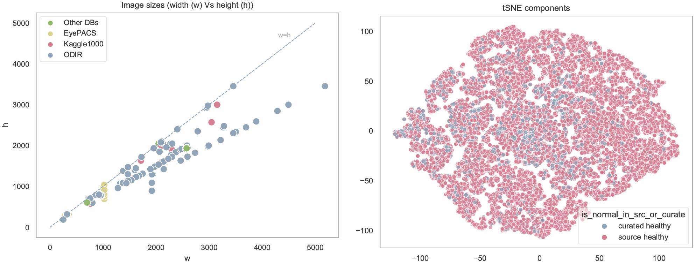
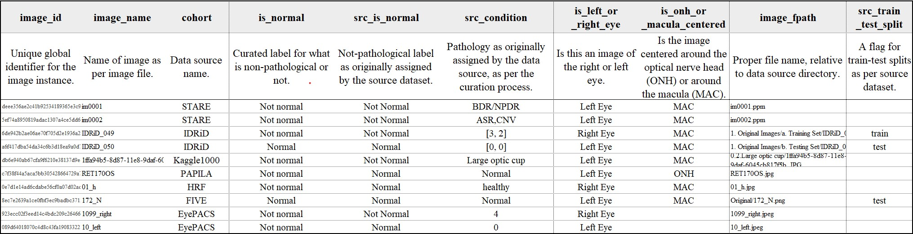

# Summary
Leveraging public datasets of Retinal Fundus Photographs (RFPs) is burdened by technical heterogenities such as variations in data organization, equipment-specific configurations, and contextualized definitions of what constitutes a non-pathological observation. The Integrated Retinal Fundus Set (IRFundusSet) systematically integrates 46,064 RFPs from ten distinct public sources into a unified structure, implementing essential methodological steps to enable collation of archives, standardization of image pixel data, and seamless integration into a modelling pipeline. Specifically, IRFundusSet entails a Python module for automated collation and harmonization of the public datasets, and a data catalogue of the images and their metadata. Functionality includes parsing archive-specific directory structures, metadata extraction, image pixel data standardization, and the creation of a curated label that identifies truly healthy eyes. Additionally, the module avails the unified dataset via an interface that streamlines integration with existing model training pipelines.  


# Statement of need
Access to large-scale, diverse and representative datasets enables robust model training and generalizability, a challenge in the translation of retinal fundus-based artificial intelligence (AI)[@grzybowski_artificial_2023]. While aggregated public RFP datasets offer the requisite diversity and scale, their consolidation into a cohesive analytical resource is encumbered by methodological non-uniformity[@khan_global_2021]. This technical heterogeneity across data from various centers and acquisition periods introduces systematic biases and imposes a significant, redundant data preparation burden on researchers. The Integrated Retinal Fundus Set (IRFundusSet) takes on the challenges of consolidating disparate directory structures, establishing harmonization dimensions, preparing the standardization operations, and, eventually, establishing the unified dataset, allowing research efforts to focus on core scientific issues. 
 

# The data sources
IRFundusSet identifies ten public RFP repositories based on ease of access and their contribution towards capturing diverse properties for RFP modeling. The sources represent multiple collection centers, several ethnicities and age groups, and a variety of retinal lesions and pathologies including Diabetic Retinopathy (DR), Diabetic Macula Edema (DME), Age-related Macular Degeneration (AMD), Glaucoma, Cataracts and Pathological Myopia (PM). Table 1 lists these sources and their properties. For brevity purposes, a detailed description of each source and its contribution is available in the [associated pre-print for this record](https://arxiv.org/abs/2402.11488). 


**Table 1: Public retinal fundus datasets in IRFundusSet**

| Cohort | n images | n labels | year | region | n centers | FOV | mydriatic |
|---|---|---|---|---|---|---|---| 
| CHASEDB1[@fraz_ensemble_2012]| 28 | 1 | 2011 | UK | 1 | 30 |  | 
| HRF[@odstrcilik_retinal_2013]| 45 | 3 | 2013 | EU | 1 | 45 |  | 
| STARE[@hoover_locating_2000]| 397 | 42 |  | USA | 2 |  |  | 
| PAPILA[@kovalyk_papila:_2022]| 488 | 3 | 2018 – 2020 | Spain | 1 | 30 | no |  
| IDRiD[@prasanna_porwal_indian_2018] | 516 | 11 | 2009 – 2017 | India | 1 | 50 | yes | 
| Retina Cataracts[@noauthor_cataract_nodate] | 601 | 4 |  |  |  |  |  | 
| FIVES[@jin_fives:_2022] | 800 | 4 | 2016 – 2021 | China | 1 | 50 | yes | 
| Kaggle1000[@cen_automatic_2021] | 1000 | 39 | 2009 – 2018 | China | 1 | 35 – 50 | yes |
| ODIR[@noauthor_odir-2019_nodate,@noauthor_ocular_nodate] | 7000 | 329 |  | China | various | various |  | 
| EyePACS[@noauthor_diabetic_nodate,@noauthor_data_nodate] | 35108 | 5 |  | USA | 7 |  |  |


# Functionality
The Python modules are structured such that the user simply needs to download the source datasets to a local directory, and subsequently execute the module to parse, catalog and harmonize the retinal fundus images into a unified dataset. All or some of the identified sources can be considered for unification, and a template configuration file that specifies the location of included sources is provided. For integration into computational workflows, access entails a function for terminal-based processing and a dataset iterator that is aligned with PyTorch design. A user guide in the form of a Jupyter Notebook is included with the package.


```python
## Creating IRFundusSet Dataset object 
## Generates the unified dataset if it does not already exist
irf_dataset = IRFundusSet(out_dir="../output_irfundus_set__256",
                        ## Set output image sizes and harmonization method
                        out_img_w_size=256,
                        harmonize_method=None,
                        clahe_b4_harmonize=False,
                        ## Set which of the 10 public sources to unify 
                        in_cohorts_config="../cohorts.ini", 
                        generate_only=False,
                        force_regenerate=False, 
                        ## Setting which column to use for target label 
                        target_col=None,     
                        ## Provide transforms for X image features or y-target labels   
                        xtransform=None, 
                        ytransform=None,)
```


## Harmonizing the pixel data
The Python modules implement systematic standardization across both image metadata and pixel data. Metadata parameters include image resolution and output file format. Pixel harmonization is applied hierarchically, calculated first at the source level to mitigate within-cohort variations, and then globally to aggregate into the unified dataset. Researchers may select between two scientifically supported normalization strategies: 1. A standard method that makes use of the mean and standard deviation, and 2. A robust method, which employs the median and inter-quartile range.    


## Curating a global not-pathological label
We leverage existing extensive literature (such as clinical literature, visual atlases and specialized guidelines) to resolve the varying definitions of what a healthy or non-pathological observation entails. Three rounds of manual curation determine a global non-pathological label, incrementally refining the quality of the label and eventually updating the consolidated data catalogue with this label. Figure 1 summarizes the steps taken to arrive at this label.


{width="70%" .center-image}


## Summary of data properties
We consolidate 46,064 images from the ten archives and manually curate 25,406 images for annotation with a global `is_normal` label. Of the curated images, we confidently label 19,871 images, of which 3,515 eyes are deemed healthy, normal or non-pathological. Table 2 summarizes the distributions of the resulting unified dataset, while Figure 2 includes a t-SNE plot that qualitatively explores  biases associated with the newly curated `is_normal` label. We find no distinct segregation of the images based on this new label. A snapshot of the resulting unified catalogue, demonstrating available metadata, is illustrated in Figure 3. 








**Table 2: Distribution of new label** 

|  | n images | n src normal | \% left eye | \% curated | \% old label was normal | \% new label is normal |
|---|---|---|---|---|---|---|
| CHASEDB1 | 28 | 0 | 0.50 | 1.00 | 0.000 | 0.000 |
| HRF | 45 | 15 | 0.47 | 1.00 | 0.333 | 0.289 |
| STARE | 397 | 36 | 0.46 | 1.00 | 0.091 | 0.076 |
| PAPILA | 488 | 333 | 0.50 | 1.00 | 0.682 | 0.168 |
| IDRiD | 597 | 168 | 0.52 | 1.00 | 0.281 | 0.201 |
| Retina Cataracts | 601 | 300 | 0.50 | 1.00 | 0.499 | 0.186 |
| FIVES | 800 | 200 | 0.47 | 1.00 | 0.250 | 0.176 |
| Kaggle1000 | 1000 | 38 | 0.42 | 1.00 | 0.038 | 0.038 |
| ODIR | 7000 | 2816 | 0.50 | 1.00 | 0.402 | 0.117 |
| EyePACS | 35108 | 25802 | 0.50 | 0.41 | 0.735 | 0.149 |
| **Total** | 46064 | 29708 | 0.48 | 0.94 | 0.331 | 0.140 |
| **Total Without EyePACS** | 10956 | 3906 | 0.48 | 1.00 | 0.286 | 0.139 |


## Code availability
The Integrated Retinal Fundus Set (IRFundusSet) is publicly available on Github and Zenodo. The IRFundusSetPython modules are on Github at https://github.com/bilha-analytics/IRFundusSet, while the independent curated catalogue is on Zenodo at https://zenodo.org/records/10617824. 


# Acknowledgements
We thank the support from the National Natural Sci-ence Foundation of China 31970752; Science, Technology, Innovation Commission of Shenzhen Municipality JCYJ20190809180003689, JSGG20200225150707332,JCYJ20220530143014032,ZDSYS20200820165400003,WDZC20200820173710001, WDZC20200821150704001, JSGG20191129110812708,KCXFZ20211020163813019; Shenzhen Bay Laboratory Open Funding, SZBL2020090501004; Department of Chemical Engineering-iBHE special cooperation joint fund project, DCE-iBHE-2022-3; Tsinghua Shenzhen Interna-tional Graduate School Cross-disciplinary Research and Innovation Fund Research Plan, JC2022009; and 　 Bureau of Planning, Land and Resources of Shenzhen Municipality (2022) 207.
 
# References

